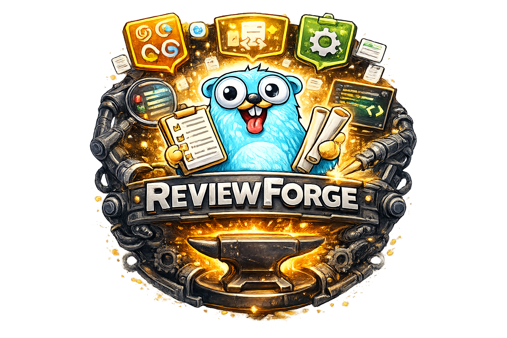

<div align="center">
  
</div>

# ReviewForge

AI-powered code reviewer with personality — GitHub Action & CLI.

ReviewForge reviews GitHub pull requests using AI (OpenAI, Anthropic, or Gemini), posting line-level comments with severity levels and review verdicts. It supports reviewer personas that add personality to reviews, multilingual output, and learning reports for developer growth.

## Features

- **Multi-provider AI**: OpenAI, Anthropic, and Gemini support
- **Line-level comments**: Precise feedback on specific code lines with severity (critical/warning/suggestion)
- **Review verdicts**: Approve, request changes, or comment with confidence scores
- **Incremental reviews**: Only review new changes since the last bot review (default: on)
- **Reviewer personas**: Built-in personalities (Bob, Robert, Maya, Eli) or custom personas
- **Multilingual reviews**: Write review comments in any language via `--language`
- **Learning reports**: Save JSON reports with techniques spotted, what went well, and areas to improve
- **File filtering**: Exclude files by glob patterns
- **Context files**: Include project files (README, package.json) for better AI context
- **Dry-run mode**: Test locally without posting to GitHub
- **Docker-based GitHub Action**: No Node.js runtime needed, fast cold starts
- **Standalone CLI**: Run reviews from your terminal

## Quick Start (GitHub Action)

```yaml
name: Code Review

on:
  pull_request:
    types: [opened, synchronize]

permissions:
  contents: read
  pull-requests: write

jobs:
  review:
    runs-on: ubuntu-latest
    steps:
      - uses: actions/checkout@v4
      - uses: AxeForging/reviewforge@v1
        with:
          GITHUB_TOKEN: ${{ secrets.GITHUB_TOKEN }}
          AI_PROVIDER: openai
          AI_MODEL: gpt-4
          AI_API_KEY: ${{ secrets.OPENAI_API_KEY }}
```

### Reusable Workflow

For teams that want a shared, consistent setup across multiple repos:

```yaml
# .github/workflows/reviewforge.yml (in a shared workflow repo)
name: ReviewForge

on:
  workflow_call:
    inputs:
      ai_provider:
        type: string
        default: 'openai'
      ai_model:
        type: string
        default: 'gpt-4'
      persona:
        type: string
        default: ''
      language:
        type: string
        default: ''
      max_comments:
        type: string
        default: '25'
      exclude_patterns:
        type: string
        default: '**/*.lock,**/*.json,**/*.md'
    secrets:
      ai_api_key:
        required: true
      github_token:
        required: true

permissions:
  contents: read
  pull-requests: write

jobs:
  review:
    runs-on: ubuntu-latest
    steps:
      - uses: actions/checkout@v4
      - uses: AxeForging/reviewforge@v1
        with:
          GITHUB_TOKEN: ${{ secrets.github_token }}
          AI_PROVIDER: ${{ inputs.ai_provider }}
          AI_MODEL: ${{ inputs.ai_model }}
          AI_API_KEY: ${{ secrets.ai_api_key }}
          PERSONA: ${{ inputs.persona }}
          LANGUAGE: ${{ inputs.language }}
          MAX_COMMENTS: ${{ inputs.max_comments }}
          EXCLUDE_PATTERNS: ${{ inputs.exclude_patterns }}
```

Then in each repo, just call it:

```yaml
# .github/workflows/code-review.yml
name: Code Review
on:
  pull_request:
    types: [opened, synchronize]

jobs:
  review:
    uses: your-org/.github/.github/workflows/reviewforge.yml@main
    with:
      ai_provider: gemini
      ai_model: gemini-2.5-flash
      persona: eli
      language: pt-br
    secrets:
      ai_api_key: ${{ secrets.GEMINI_API_KEY }}
      github_token: ${{ secrets.GITHUB_TOKEN }}
```

## Quick Start (CLI)

```bash
# Install
go install github.com/AxeForging/reviewforge@latest

# Review a PR (dry-run)
reviewforge review \
  --provider openai \
  --model gpt-4 \
  --api-key $OPENAI_API_KEY \
  --github-token $GITHUB_TOKEN \
  --repo owner/repo \
  --pr 42 \
  --dry-run

# With a persona + language + learning report
reviewforge review \
  --provider gemini \
  --model gemini-2.5-flash \
  --api-key $GEMINI_API_KEY \
  --github-token $GITHUB_TOKEN \
  --repo owner/repo \
  --pr 42 \
  --persona eli \
  --language pt-br \
  --save-report review-report.json
```

## Personas

ReviewForge includes built-in reviewer personas that modify the review style:

| Persona | Name | Style |
|---------|------|-------|
| `bob` | Bob Lil Swagger | Friendly, encouraging. Celebrates good code, suggests improvements warmly, teaches while reviewing. |
| `robert` | Robert Dover Clow | Nerdy tech expert. Names every pattern spotted, references CS concepts and SOLID principles. |
| `maya` | Maya Simplifica | Everyday analogies teacher. Explains concepts using cooking, building, gardening and other real-world parallels. |
| `eli` | Eli Passo | Beginner-friendly mentor. Patient explanations for newcomers, avoids jargon, celebrates small wins, suggests learning paths. |
| _(empty)_ | Default | Standard expert code reviewer. Professional, thorough, no personality overlay. |

### Custom Personas

```bash
# Inline JSON
reviewforge review --custom-persona '{"name":"strict","prompt":"Be extremely strict..."}' ...

# From file
reviewforge review --custom-persona-file ./my-persona.json ...
```

### GitHub Action with Persona

```yaml
- uses: AxeForging/reviewforge@v1
  with:
    GITHUB_TOKEN: ${{ secrets.GITHUB_TOKEN }}
    AI_PROVIDER: anthropic
    AI_MODEL: claude-sonnet-4-20250514
    AI_API_KEY: ${{ secrets.ANTHROPIC_API_KEY }}
    PERSONA: maya
    LANGUAGE: pt-br
```

## Language Support

Use locale codes or language names for `--language` / `LANGUAGE`:

| Code | Language |
|------|----------|
| `en-us` | English (US) |
| `en-gb` | English (UK) |
| `pt-br` | Brazilian Portuguese |
| `pt-pt` | European Portuguese |
| `es` | Spanish |
| `es-mx` | Mexican Spanish |
| `fr` | French |
| `fr-ca` | Canadian French |
| `de` | German |
| `it` | Italian |
| `ja` | Japanese |
| `ko` | Korean |
| `zh-cn` | Simplified Chinese |
| `zh-tw` | Traditional Chinese |

You can also use full language names directly: `--language "Brazilian Portuguese"`.

## Learning Reports

Use `--save-report <path>` to save a JSON report with learning insights:

```bash
reviewforge review \
  --provider gemini \
  --model gemini-2.5-flash \
  --api-key $GEMINI_API_KEY \
  --github-token $GITHUB_TOKEN \
  --repo owner/repo \
  --pr 42 \
  --persona eli \
  --save-report report.json
```

The report includes:

```json
{
  "repo": "owner/repo",
  "pr_number": 42,
  "pr_title": "Add retry logic",
  "provider": "gemini",
  "model": "gemini-2.5-flash",
  "persona": "eli",
  "review": {
    "summary": "...",
    "comments": [...],
    "suggestedAction": "comment",
    "confidence": 88,
    "learning": {
      "techniques_spotted": ["Error wrapping", "Retry with backoff", "Builder pattern"],
      "what_went_well": ["Clean separation of concerns", "Good error messages"],
      "areas_to_improve": ["Add context.Context for cancellation", "Consider exponential backoff"],
      "key_takeaways": ["Always close response bodies with defer", "Retry only idempotent operations"]
    }
  },
  "files_reviewed": ["helpers/http.go"]
}
```

Great for tracking developer growth, onboarding, and team learning.

## Configuration

### GitHub Action Inputs

| Input | Required | Default | Description |
|-------|----------|---------|-------------|
| `GITHUB_TOKEN` | Yes | - | GitHub token for API access |
| `AI_PROVIDER` | Yes | `openai` | AI provider: `openai`, `anthropic`, `gemini` |
| `AI_MODEL` | Yes | `gpt-4` | Model name |
| `AI_API_KEY` | Yes | - | API key for the provider |
| `AI_TEMPERATURE` | No | `0` | Temperature (0-1) |
| `APPROVE_REVIEWS` | No | `true` | Allow approve/request changes verdicts |
| `MAX_COMMENTS` | No | `25` | Max line comments (0 = unlimited) |
| `INCREMENTAL` | No | `true` | Only review new changes |
| `EXCLUDE_PATTERNS` | No | `**/*.lock,**/*.json,**/*.md` | Glob patterns to exclude |
| `CONTEXT_FILES` | No | `package.json,README.md` | Files for AI context |
| `PROJECT_CONTEXT` | No | - | Additional project context string |
| `PERSONA` | No | - | Built-in persona: `bob`, `robert`, `maya`, `eli` |
| `CUSTOM_PERSONA` | No | - | Custom persona JSON |
| `CUSTOM_PERSONA_FILE` | No | - | Path to persona JSON file |
| `LANGUAGE` | No | - | Review language (e.g. `pt-br`, `es`, `French`) |

### CLI Flags

All inputs are available as CLI flags with `--kebab-case` naming. Run `reviewforge review --help` for the full list.

Additional CLI-only flags:
- `--save-report <path>` — Save JSON learning report to file
- `--dry-run` — Print review JSON without posting to GitHub

## Commands

```bash
reviewforge review [flags]    # Review a PR
reviewforge personas          # List available personas
reviewforge version           # Show version info
reviewforge --help            # Show help
```

## Development

```bash
# Build
make build-local

# Test
make test

# Cross-platform build
make build

# Install locally
make install
```

## License

MIT
